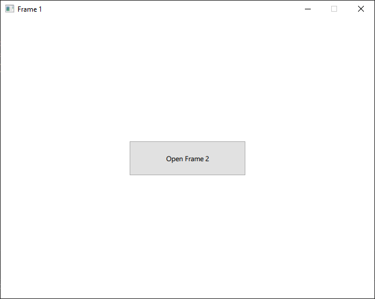
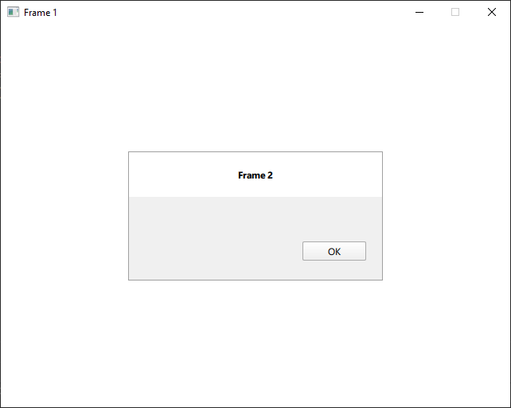
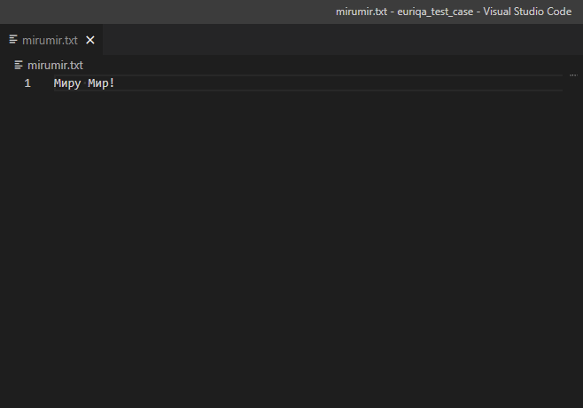

# euriqa_test_case
Данное приложение реализует открытие двух форм:
## Первая

    

При нажатии на кнопку «Open Frame 2» открывается вторая форма
## Вторая

    

При нажатии на кнопку во торой форме происходит сохранение строки «Миру мир!» в текстовый файл mirumir.txt

# Результат

    

